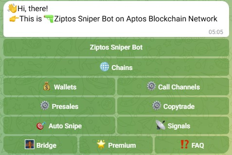

  

<b>Telegram Bot Username</b>: <a href="https://web.telegram.org/a/#7659999577">@aptos_snipe_bot</a>

<h3>Description:</h3>
The users can create, import and delete the wallets and add the tokens they want to trade.

The bots buys the tokens as soon as the token you want to trade is added to liquidity pool.
This bot uses the panora API and swap the tokens you target with APTOS token on Aptos Blockchain Network.

  

<h3>Commands:</h3>
<b>/start</b>: Starting the bot 
<b>/help</b>: Show all available commands 
